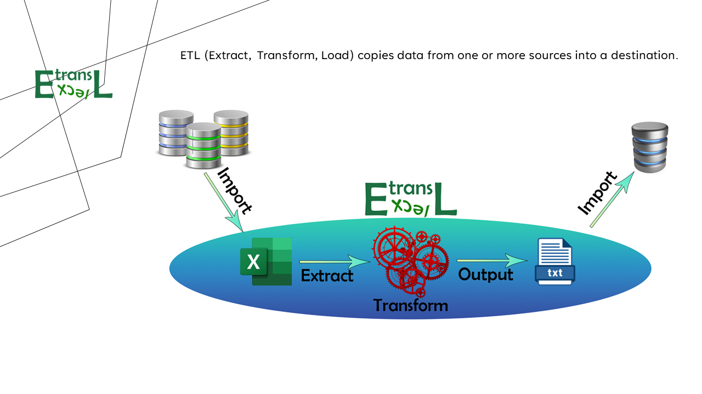
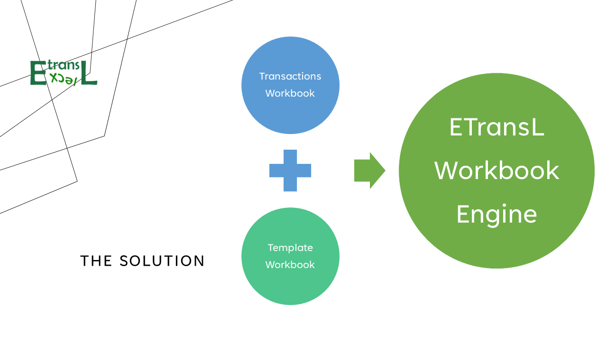
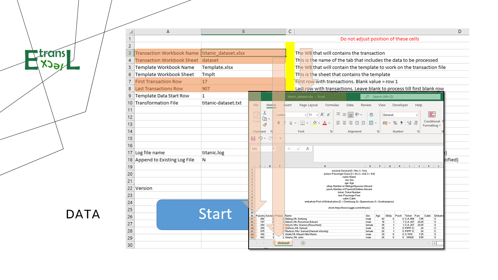
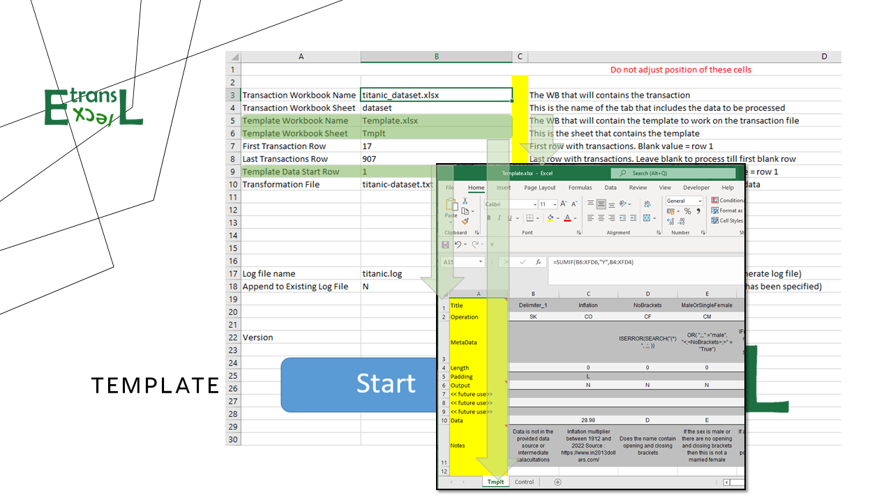
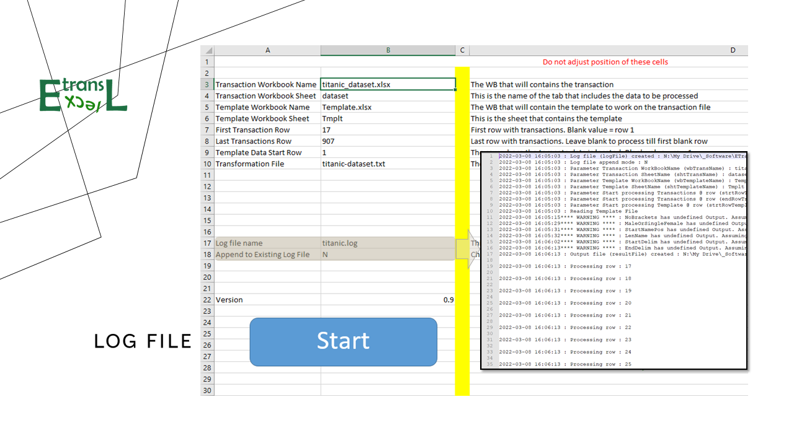
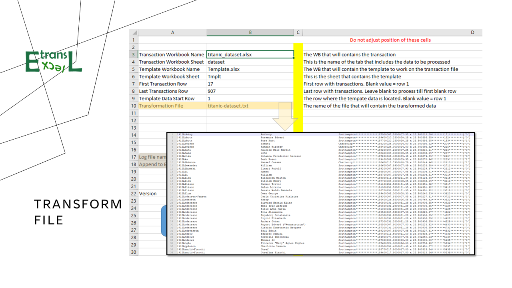

# ETransL

ETransL is **ETL** engine that converts data imported into Microsoft Excel to fixed or comma delimited text.

*ETL stands for extract, transform, load. It is the general procedure of copying data from one or more sources into a destination system which represents the data differently from the source(s) or in a different context than the source(s). It is often used in data warehousing.* [Wikipedia page](https://en.wikipedia.org/w/index.php?title=Extract,_transform,_load&oldid=1073340515) 

ETransL is an Excel VBA script that applies a template workbook to a transaction workbook to produce a text file that can be processed further on.

The ETransL workbook is the control cen of the solution. Through it one specifies:

* The Transaction Workbook & Worksheet
* The Template Workbook & Worksheet

## The Transactions

The Transaction Worksheet contains the data that will be transformed.  The data can be any source that can be pulled into Excel. 

The name of the Transaction Workbook and Sheet direct the engine to where it can find the data it will work on.

Two additional parameters are:

* The row in the Transaction Worksheet to start processing at
* \[Optional] The row in the Transaction Worksheet to stop processing.  If the row is not specified, the engine will attempt to read all rows.

*The ETransL is designed to stop processing as soon at it encounters a blank row. This means that blank rows in the data are not allowed.*

## The Template

The Template specifies how to transform the data in the transaction file.

The Template Start row indicates where the ETransL engine should read the template instructions.

The Template data is laid out in columns. It automatically starts at column B and stops processing as soon as it encounters a blank column.

## The Log file

The Log file keep track of all parameters and the progress of all actions taken by the ETransL engine. Two actions are written to the log file:

* *Warnings* - these are assumptions and alerts that could be be different from those intended by the designer. They do not cause ETransL to stop.
* *Errors* - these are conditions that ETransL couldn't handle. Errors stop processing. 

After each run, the log file should be inspected to make sure that the processing took place as expected. With large data sets an error could impact the processing of the transformtion file by other systems.

## The Transformation file

The Transformation file rapresents the '**T**' of ETL. It is the output of ETransL and rapresents the processed data. 

