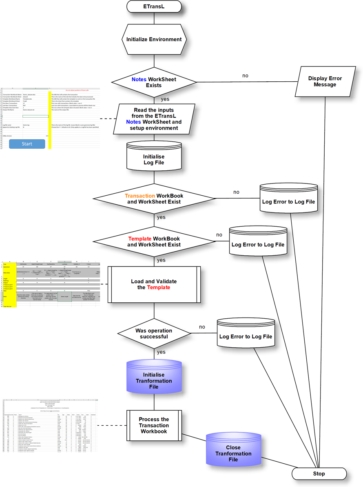

# ETransL Technical Documentaiton

## EtransL Top Level Analysis

### Revisions

| Date    	| Author 	| Doc Ver 	| Comments               	| Applies to v 	|
|---------	|--------	|---------	|------------------------	|--------------	|
| 2022-03 	| ACB    	| 1.0     	| First Draft of ETransL 	| 0.9x         	|
|         	|        	|         	|                        	|              	|
|         	|        	|         	|                        	|              	|

___

### Flowchart

### Code Walkthrough

ETransL execution is as follows:

* Initialises the environment, reads from the **Inputs** Worksheet the inputs and logs everything:
  *  Mandatory parameters:
     + Transaction Workbook Name
	 + Transaction Workbook Sheet
     + Template Workbook Name
	 + Template Workbook Sheet
	 + First Transaction Row

  *  Parameters that will be autofilled if left blank:
     + First Transaction Row - Assumed to be '*1*'
     + Last Transactions Row - Assumed to be '*1048576*'
     + Template Start Row - Assumed to be '*1*'
     + Transformation File - ETransL will set the name to execution date and time (*yyyyMMdd-hhmm.txt*)
  + Log file name - ETransL will set the name to execution date and time (*yyyyMMdd-hhmm.log*)
  + Append to Existing Log File - Assumed '*Y*'

* Read in and process the Template file. The template file is laid out in columnar fashion with each column representing a single operation. Operations are described in detail elsewhere.
  + Different operations can take additional parameters. 
  + The following parameters are associated with each operation:
    + **Title**: MANDATORY / UNIQUE – All operations except ‘SK’ generate output and this output must be referenced by it’s Title.
    + **Operation**: MANDATORY / ONE OF [CF, CM, CO, IR, MC, RW, SK, TX)  – Describes an action to be performed by ETransL.
    + **MetaData**: MANDATORY depending on operation
    + **Length**: MANDATORY must be >= 0. If the value is zero, ETransL does not attempt adjust the computed result. A length other than zero will pad or trim the result so that it the desired length (see Padding).
    + **Padding**: MANDATORY defaults to *R*. If the length of the result is less than length the output needs to be padded. Padding is made up to two components:
       + *L* or *R* to describe where characters are to be added to the result (L = Left, R = Right)
       + The characters to be used as padding. If unspecified the default is set to *\<space\>*. Padding characters can be longer than 1 character.
    + **Output**: MANDATORY (defaults to *Y*)
    + **Data**: MANDATORY depending on operation
    + **Notes**: These are not referenced by ETransL
  + **Total Rec Len**: This is not referenced by ETransL. It is used to provide an indication of the output.  The value is computed by totalling the **Length** row of all those operations that have **Output** set to '*Y*'.

* The Transaction file is processed from the start row specified in the input until the end row is greater than that specified in the input. Processing will terminate when a blank-row is encountered.
  * For each row of transaction file the Template file is processed starting at column B until a blank column is encountered.
  * The row being processed as well as Warning or Error conditions as logged to the file.  An unhandled error condition may abort processing.
  * When all the columns of the template file have been processed the output is written to the Transformation File

* Processing terminates if an Error condition is encountered.

* File handles are closed and the user is alerted that ETransL has terminated.

